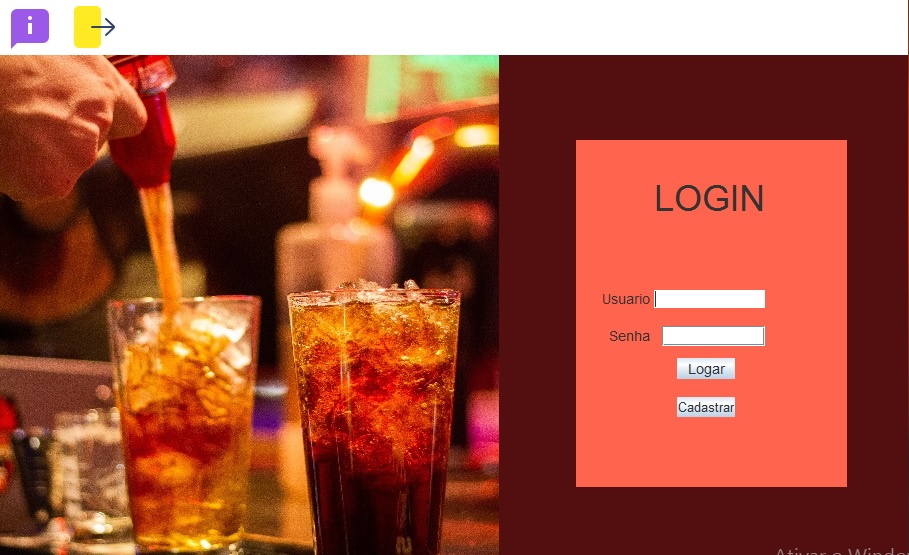
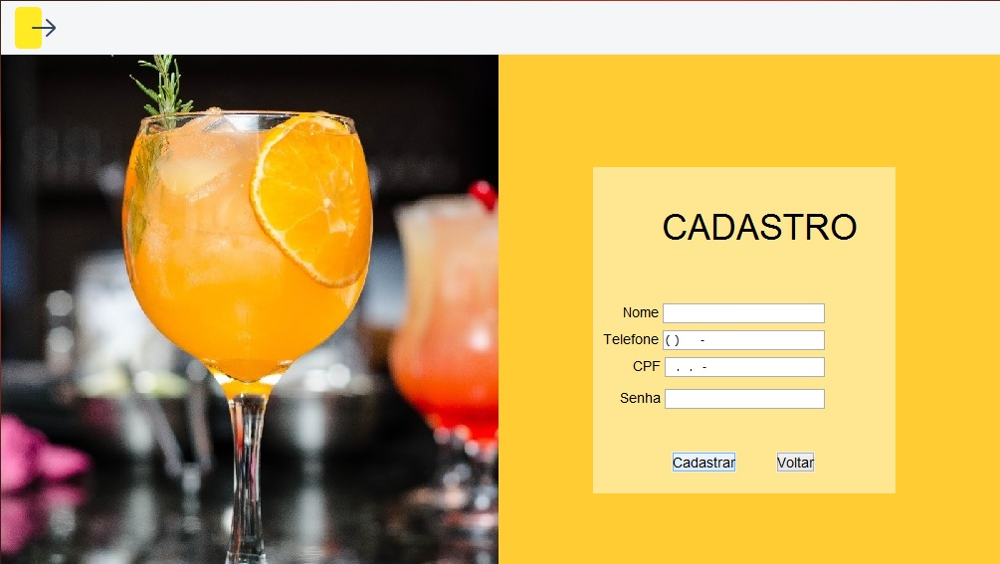
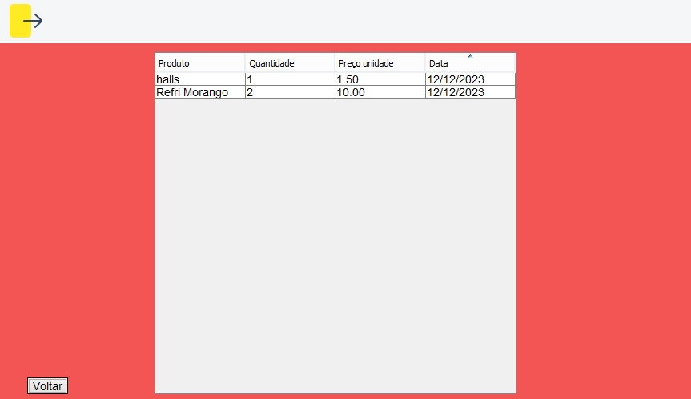
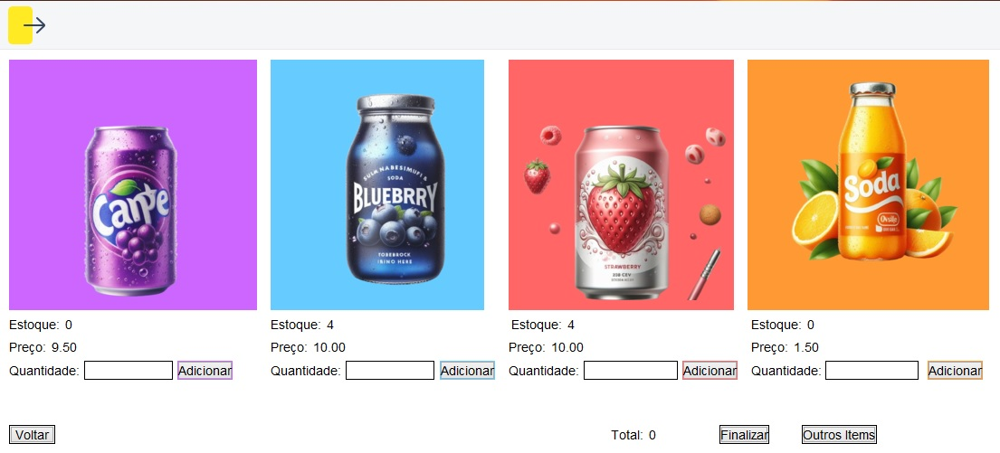

# Distribution Company Project

## Description
This project was developed as part of the Methods and Techniques of Programming course at **Institute Federal Of Goiás**. The aim is to create a management system for a distribution company, allowing inventory control, sales tracking.

## Key Features
- Product registration and management.
- Inventory and stock control.
- Sales recording and tracking.

## Technologies Used
- Programming Language:
          
- Database: 
          
          

## How to Use

### Requirements:
- XAMPP installed to run the MySQL server.
- Access to the project's database file located in the 'BD' folder.

### Installation:
1. Download and install XAMPP from [XAMPP's official website](https://www.apachefriends.org/index.html).
2. Open XAMPP and start the MySQL server.
3. Locate the project's database file in the 'BD' folder and load it into the XAMPP MySQL.

### Configuration:
- No additional configuration is required if the database file is properly loaded into the XAMPP MySQL.

### Execution:
1. Download the project's files and navigate to the 'dist' folder.
2. Run the 'BevarageDistributor.jar' file while XAMPP's MySQL server is running.

## Contributions
Contributions are welcome! If you'd like to improve this project in any way, feel free to open a pull request.

## Authors
- [Kalysson Ryan]
- [Ruan Rocha]

## Image Credits & Icons
### From Pexels
Images sourced from [Pexels](https://www.pexels.com/), a platform offering free stock photos with licenses allowing free use.

### From Bing Ai
Some images sourced from [Bing](https://www.bing.com/?/ai), For searches and text or image generation, help Bing AI give you what you want by being as specific as possible

## Icon Credits
-All icons used in this project are from [Flaticon](https://www.flaticon.com/), a platform offering a wide range of free icons with various licenses allowing free use.

## Screenshots
Include screenshots to visualize the interface of the system:

- Login Screen

- Registration Screen

- Sales Screen

- Products Screen

